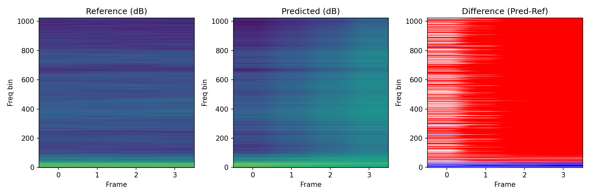
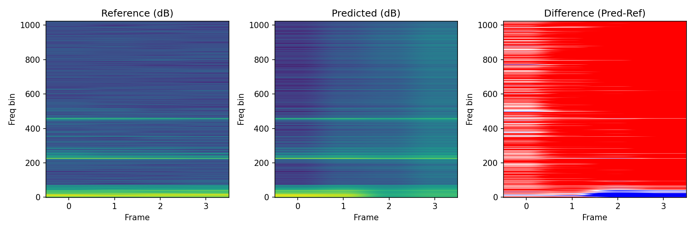

# IFF-AR: Conditional Autoregressive Audio Generation via Instantaneous Frequency Modeling

**Author:** Valerio Santini
**Course:** Deep Learning & Applied AI (DLAI 2024/2025) — Sapienza University of Rome  

---

## Overview

**IFF-AR (Instantaneous Frequency Flow–Autoregressive)** is a generative model for audio synthesis in the frequency domain, designed to jointly predict **log-magnitude** and **instantaneous frequency (IF)** instead of relying on iterative phase reconstruction.

Unlike models based on Griffin–Lim or independent phase estimation, IFF-AR treats the **phase as a learnable probabilistic variable**, modeled via a **conditional normalizing flow** (RealNVP-style) conditioned on both **context** and **spectral energy**.

---

## Architecture

The IFF-AR pipeline integrates four key modules:

1. **Preprocessing** – Converts audio into STFT representations and extracts log-magnitude and instantaneous frequency (IF) per frequency bin.  
2. **Temporal Convolutional Encoder (TCN)** – A causal, dilated convolutional network capturing long-range temporal–spectral dependencies.  
3. **Magnitude Decoder (MagHead)** – Predicts normalized log-magnitude spectra from the encoded context.  
4. **Conditional Flow (IF-Flow)** – Learns the distribution of phase differences conditioned on magnitude and context, enabling consistent phase evolution.  
5. **Phase Reconstruction** – Reconstructs absolute phase by cumulative integration of predicted IF, followed by inverse STFT to obtain the waveform.

---

## Experimental Results

The model was trained on the **NSynth dataset** using *FFT = 1024*, *hop = 256*, and a Hann window.  
It achieves stable and perceptually coherent audio generation, with consistent magnitude–phase alignment.

| Metric | Value | Domain |
|:------------------|:--------:|:-----------|
| LogMag MAE | 27.477 | Spectral |
| LogMag RMSE | 33.358 | Spectral |
| IF MAE | 1.640 | Phase |
| IF RMSE | 2.004 | Phase |
| LSD (dB) | 3.719 | Spectral |
| SI-SDR (dB) | -1.537 | Perceptual |
| SI-SDR (mag GT) | -1.460 | Perceptual |

*Table 1. Quantitative evaluation on the NSynth validation set.*

---

## Audio Samples

- [Predicted audio](./eval_out/audio/02_pred_bass_electronic_027-037-100.wav)  
- [Reference audio](./eval_out/audio/02_ref_bass_electronic_027-037-100.wav)

---

## Spectrograms

| Figure 1 | Figure 2 |
|:------------------------:|:------------------------:|
|  |  |

---
## Demo Notebook

A notebook [`demo.ipynb`](./demo.ipynb) is provided to reproduce the inference pipeline of **IFF-AR**.

The demo:
1. Loads the pretrained checkpoint from the provided Drive link.  
2. Imports a test clip from the repository (`eval_out/audio/02_ref_bass_electronic_027-037-100.wav`).  
3. Runs preprocessing (STFT extraction and normalisation).  
4. Generates autoregressive predictions of log-magnitude and instantaneous frequency.  
5. Reconstructs the waveform via cumulative phase integration and inverse STFT.  
6. Displays and compares the predicted and reference spectrograms, along with playback of the generated audio.

**Checkpoint download:** [IFF-AR pretrained weights (Drive link)](https://drive.google.com/file/d/1eqt4IbJGzZD-fdxMzZnGwjMSIPdR4CBW/view?usp=share_link)  
*(place the `.pt` file in the `checkpoints/` directory before running the demo)*

> Deep Learning & Applied AI — Sapienza University of Rome.

